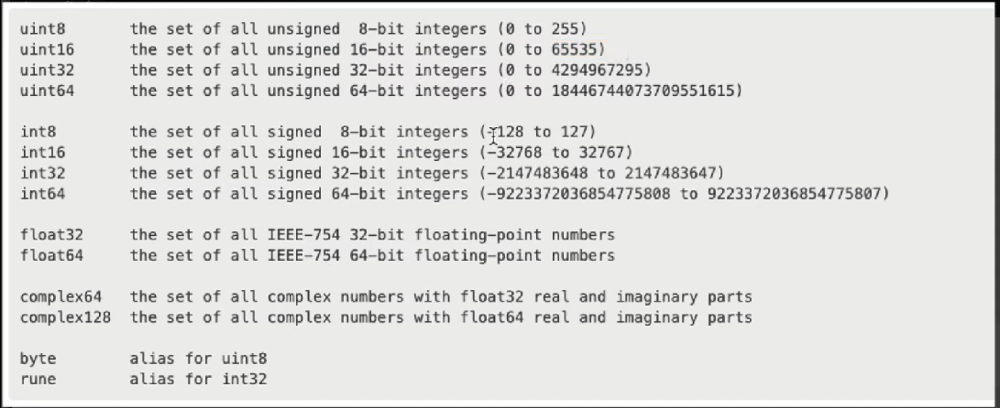

### defining a variable in GO lang

var <varibale_name> <type> = value;

## Example:
var user string = "Vinit"
var isLoggedIn bool = false <only true or false in case of bool>

varibales must be declared before using. If the varibale is declared but not initializedc. The go compiler would not place any garbage value insted it'll initialize it with 0.

## Implicit type

go automatically defines the type of variable if not defind during declararion. But later on you cannot change the type of variable once declared .

    var website = "google.com"
	fmt.Println(website);
    website = 3 ===> will throw error (cannot use 3 (untyped int constant) as string value in assignment)

## walrus operator

:=
direct assign a value and initialize a variable
can be used only inside any method.

## var and const

var ==> can change value over the period of time
const ===> once assigned the value can't be changed.
