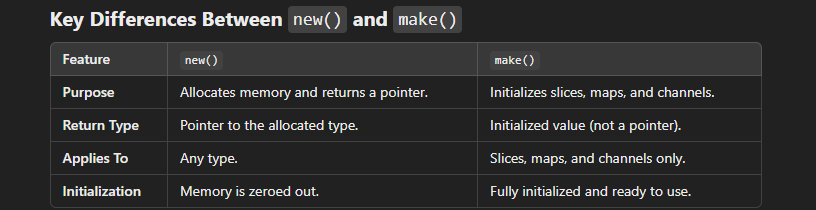

## memory allocation in go

In go memory is allocated using new() and make();

# new()
    1. Purpose: Allocates memory for a value of a specified type and returns a pointer to it.
    2. Usage: Used for creating pointers to values of basic types 
    3. Initialization: The memory is zeroed out (default value set to 0), but no further
       initialization is performed.
    4. Return Value: A pointer to the allocated memory.

# make()
    1. Purpose: Used for creating and initializing slices, maps, and channels. It allocates and 
       initializes the internal data structures needed for these types.
    2. Usage: Specifically for slices, maps, and channels only (it cannot be used with other types)
    3. Initialization: Sets up the underlying data structure so it’s ready to use.
    4. Return Value: The initialized value of the specified type (not a pointer).
    

